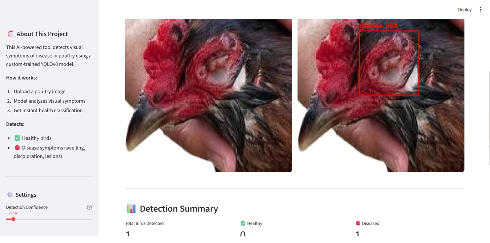
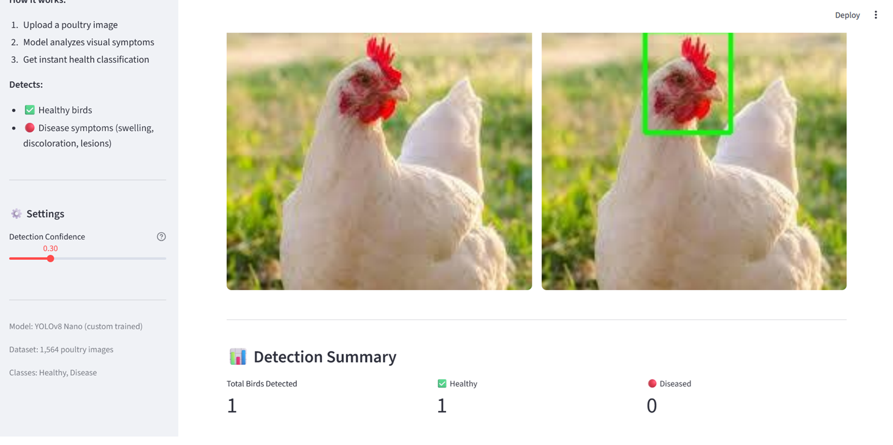

# 🐔 Poultry Health Monitor

AI-powered visual disease detection system for poultry farms using YOLOv8 and computer vision.

##  Problem Statement

Poultry farms often house thousands of birds, making manual health inspection time-consuming and error-prone. Diseases spread rapidly in close-contact environments, and by the time visible symptoms are noticed manually, significant losses may have already occurred. This project provides an automated, camera-based solution to detect visual disease symptoms early, enabling farmers to isolate affected birds before disease spreads across the flock.

## What It Does

This system analyzes poultry images and classifies birds as **Healthy** or **Disease** based on visible symptoms such as:
- Swelling and discoloration
- Eye/face abnormalities  
- Skin lesions

 **Note:** This model detects *visual* disease symptoms — not internal conditions like fever. It is designed as a screening aid for early human intervention, not a diagnostic replacement.

## 🖥️ Demo

**Disease Detection:**


**Healthy Bird Detection:**


Upload any poultry image and get instant detection results with bounding boxes, confidence scores, and health alerts.


## ✨ Features

-  Simple drag-and-drop image upload
-  Real-time disease detection with bounding boxes
-  Detection summary (healthy vs diseased count)
-  Automatic alerts when sick birds are detected
-  Adjustable confidence threshold
-  Clean, responsive web interface

## Tech Stack

| Component | Technology |
|---|---|
| Object Detection | YOLOv8 (Ultralytics) |
| Image Processing | OpenCV |
| Web Interface | Streamlit |
| Language | Python |
| Dataset Source | Roboflow |

## Model Performance

| Metric | Score |
|---|---|
| mAP50 | 38.9% |
| Precision | 45.6% |
| Recall | 40.7% |

Trained on 1,564 labeled poultry images (1,095 train / 313 validation / 156 test) across 2 classes: Healthy and Disease.

## How to Run Locally

```bash
# Clone the repository
git clone https://github.com/TriveniGadela/poultry-health-monitor.git
cd poultry-health-monitor

# Install dependencies
pip install ultralytics opencv-python streamlit pillow

# Run the app
streamlit run app.py
```

##  Project Structure
poultry-health-monitor/

├── app.py              # Streamlit web application

├── detect.py           # Detection logic and model inference

├── train.py             # Initial model training script

├── train_v2.py          # Improved training with augmentation

├── data/                 # Dataset (train/valid/test)

├── runs/                 # Trained model weights

└── README.md


##  Future Improvements

- Train with more epochs and larger dataset for higher accuracy
- Add video stream support for real-time farm monitoring
- Deploy on edge devices (Raspberry Pi) for on-site farm use
- Add disease-specific classification (not just healthy/disease)
- Integrate SMS/WhatsApp alerts for farmers

##  Author


**Triveni Gadela**  
B.Tech Computer Science, VVIT  
[GitHub](https://github.com/TriveniGadela)

---
⭐ If you found this project useful, consider giving it a star!